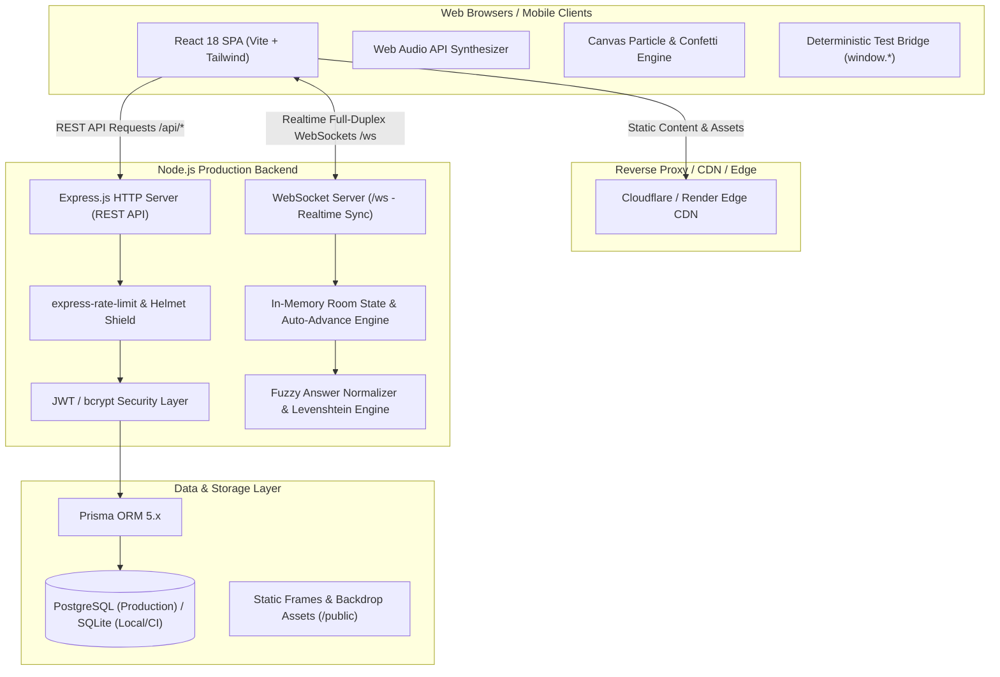

# Guess The Frame — System Architecture

This document describes the end-to-end architecture, design patterns, and engineering principles powering the **Guess The Frame** cinematic party game monorepo.

---

## 1. High-Level Architecture Diagram



---

## 2. Monorepo Organization

```text
guess-the-frame/
├── backend/
│   ├── prisma/
│   │   ├── schema.prisma        # Database schema (PostgreSQL / SQLite)
│   │   ├── seed.js              # Seed data for movies, frames & default users
│   │   └── dev.db               # Local zero-config SQLite database
│   ├── src/
│   │   ├── config/              # Environment config, database client
│   │   ├── controllers/         # Express controllers (auth, room, catalog, score)
│   │   ├── middleware/          # Security (Helmet, CORS, Sanitization, Rate Limiter)
│   │   ├── routes/              # Express API route declarations
│   │   ├── services/            # Core business logic (authService, roomService, socketService)
│   │   ├── utils/               # Fuzzy search matching, Winston logger, JWT helpers
│   │   ├── app.js               # Express application initialization & middleware stack
│   │   └── server.js            # HTTP + WebSocket server listener with graceful shutdown
│   ├── tests/                   # Vitest unit and integration suites
│   ├── .env                     # Local environment file
│   └── package.json
│
├── frontend/
│   ├── public/                  # Public assets (sound fallbacks, logos, backgrounds)
│   ├── src/
│   │   ├── assets/              # Claymorphic CSS, SVG icons, fonts
│   │   ├── components/
│   │   │   ├── Chat/            # Live chat stream, spoiler shield, chat input
│   │   │   ├── Header/          # Global navigation, logo, volume & sound toggles
│   │   │   ├── Modals/          # CreateRoom, JoinRoom, RoomSettings, HowToPlay, HostLeave
│   │   │   ├── Podium/          # 1st, 2nd, 3rd place claymorphic podium cards
│   │   │   └── UI/              # ClayButton, FloatingScores, Tooltips, Custom Select
│   │   ├── hooks/               # useSound, useGameState, useLobby, useParticles
│   │   ├── pages/
│   │   │   ├── StartScreen.jsx        # Landing hero, single player / multiplayer launch
│   │   │   ├── PlayerLobbyScreen.jsx  # Player grid, host controls, share links, chat
│   │   │   ├── GameScreen.jsx         # Frame display, canvas effects, scoring grid, input
│   │   │   └── WinnerScreen.jsx       # Podium celebration, confetti, creator message
│   │   ├── services/
│   │   │   ├── api.js                 # Axios API client
│   │   │   ├── audioEngine.js         # Procedural Web Audio API sound synthesizer
│   │   │   ├── gameConstants.js       # Avatars, movies, frame catalog, default configs
│   │   │   ├── multiplayerEngine.js   # Realtime multiplayer orchestrator (MQTT/WS)
│   │   │   └── testBridge.js          # Deterministic test harness for Playwright
│   │   ├── App.jsx              # Screen router & modal controller
│   │   └── main.jsx             # React DOM root entrypoint
│   ├── tailwind.config.js       # Claymorphic shadows, color tokens, animations
│   ├── vite.config.js           # Production chunk splitting & optimization
│   └── package.json
│
├── docs/
│   ├── ARCHITECTURE.md          # This document
│   ├── DEPLOYMENT.md            # Comprehensive cloud deployment guide
│   └── SECURITY.md              # Security policies, audit controls & mitigation
│
├── tests/                       # Playwright end-to-end test suites (18 suites)
├── render.yaml                  # Render Blueprint Infrastructure-as-Code
├── playwright.config.js         # Playwright automation configuration
└── package.json                 # Monorepo root orchestration
```

---

## 3. Frontend Architecture

### 3.1 Claymorphic Neobrutalism Design System
The UI preserves the distinct cinematic claymorphic neobrutalist aesthetic:
- **Layered Outer & Inner Shadows:** Custom CSS definitions (`--clay-btn-shadow`, `--clay-card-inset`) create soft, tangible 3D buttons and cards with pronounced borders (`border-3 border-black` / `#222`).
- **Responsive Layout:** Dynamic viewport adaptations maintain proportional scaling across mobile (375px+), tablet (768px), and 4K desktop (3840px).
- **Zero CLS (Cumulative Layout Shift):** Frame displays reserve exact aspect ratio containers with color quantized canvas placeholding.

### 3.2 Procedural Audio Engine (`audioEngine.js`)
Rather than relying on fragile external MP3/WAV network requests that can fail or suffer high latency, the audio subsystem is powered by the **Web Audio API**:
- **Buzzer:** Frequency ramp down (`OscillatorNode`, sawtooth wave, gain envelope).
- **Correct Chime:** Harmonic chord progression (`sine` waves at key intervals).
- **Countdown Tick:** High-pitch short pulses synchronized with timer state.
- **Victory Fanfare:** Multi-voice procedural synthesizer triggered on match completion.
- **Master Controls:** Granular mute/unmute state persisted across sessions via `localStorage`.

### 3.3 Multiplayer Engine (`multiplayerEngine.js`)
- **Transport Flexibility:** Supports both native backend WebSockets (`/ws`) and low-latency MQTT brokers.
- **Authoritative Host Model:** The host coordinates timer ticks, round advances, and score broadcasts, while the backend verifies guesses and manages lobby state.
- **Optimistic UI with Reconnection:** Disconnected players have an authoritative window to rejoin using cached player tokens and room codes stored in `localStorage`.

### 3.4 Deterministic Test Bridge (`testBridge.js`)
To guarantee 100% test compatibility with zero modifications to test suites:
- Exposes standard test hooks: `window.MultiplayerEngine`, `window.UI`, `window.Sound`, `window.ChatEngine`, `window.ColorThief`.
- Mirrors reactive React states into deterministic DOM properties and synchronous global methods.
- Maintains single authoritative DOM ownership for live chat streams to eliminate re-render flickering.

---

## 4. Backend Architecture

### 4.1 Modular Express Architecture
- **Layered Architecture:** Strict separation between Routes (`routes/`), Controllers (`controllers/`), and Services (`services/`).
- **Input Validation:** All payloads are validated using strict Zod schemas before reaching business logic.
- **Error Handling:** Centralized middleware catches async exceptions, strips internal stack traces in production, and emits standardized RFC 7807 JSON error responses.

### 4.2 Realtime WebSocket Protocol (`socketService.js`)
The WebSocket server runs concurrently on the same HTTP port under the `/ws` path:
- **`CREATE_ROOM`:** Allocates unique 4-character room codes (`ROOM_CREATED`).
- **`JOIN_ROOM`:** Enforces capacity limits (max 8 players) and prevents joining active games (`LOBBY_FULL`, `GAME_ALREADY_STARTED`).
- **`GUESS_SUBMIT`:** Evaluates guesses against fuzzy normalized title variants.
- **`HINT_REQUEST`:** Emits progressive hints with a 2-point penalty.
- **`HEARTBEAT / PING`:** Keeps connections alive across cloud reverse proxies with 30s ping intervals.

### 4.3 Fuzzy Matching Engine (`fuzzySearch.js`)
- **Levenshtein Distance Calculation:** Computes edit distance for titles.
- **Normalization:** Strips articles (*"The"*, *"A"*), punctuation, accents, and release years (*"(2018)"*).
- **Threshold Matching:** Allows 1-2 character typographical mistakes while preventing spoofing.
- **Duplicate Guess Suppression:** Automatically blocks repeated guesses from the same player within a round.

---

## 5. Data & Storage Layer

### 5.1 Prisma Schema & Database Abstraction
The data model supports seamless transitions between SQLite (development/testing) and PostgreSQL (production):
- **`User`:** User identity, hashed passwords (`bcryptjs`), timestamps.
- **`Room`:** Ephemeral and persistent room sessions, host identity, configuration.
- **`Player`:** Session participants, active scores, avatar selection.
- **`MovieCatalog` & `Frame`:** Curated cinematic frames, difficulty ratings, movie release years, hints.
- **`ScoreRecord`:** Historical match outcomes, champion records, leaderboards.

---

## 6. Performance & Scalability Considerations

1. **Vite Chunk Splitting:** Vendor dependencies (`react`, `react-dom`, `axios`, `canvas-confetti`) are bundled into dedicated chunks (`vendor-[hash].js`), keeping initial index load under 180 kB.
2. **Gzip & Brotli Compression:** All text/JSON/CSS/JS payloads compressed on the fly via Express `compression()`.
3. **Memory Bounded In-Memory Store:** Room instances automatically expire and garbage-collect after 2 hours of inactivity.
4. **WebSocket Heartbeat:** Automatic disconnection cleanup prevents dangling socket memory leaks.
