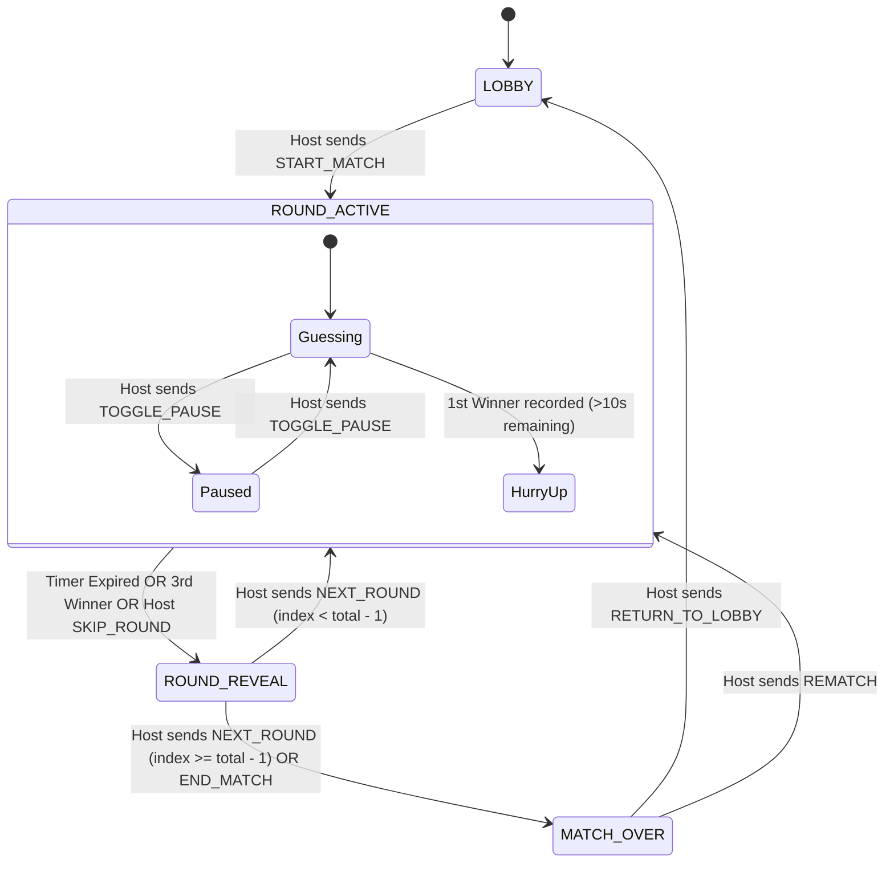

# ScoopCast Official Multiplayer Game Rules Specification

This document defines the definitive, server-authoritative game rules and logic for **ScoopCast** (`Guess The Frame Online`). All game mechanics, state transitions, scoring, timers, validations, and constraints are strictly enforced by Cloudflare Durable Objects (`partykit/src/server.ts`). Clients (web browsers, mobile web) are strictly untrusted rendering and presentation surfaces.

---

## 1. Game Overview

ScoopCast is a real-time multiplayer movie and pop-culture trivia game. Players join a shared room hosted on Cloudflare's global edge network. In each round, players are presented with a visual frame, an actor's eyes, or a dialogue clip from a movie or television show. Players compete to identify the correct title as quickly as possible.

### Core Architecture Principle
- **Cloudflare Durable Object as Single Source of Truth**: Every room is backed by a persistent Cloudflare Durable Object (`GameRoomServer`).
- **Zero Client Authority**: Clients never calculate scores, never determine winner eligibility, never dictate timers, never validate correctness locally, and never store unmasked answers for active rounds.
- **Deterministic Edge Execution**: All events are serialized, validated against authoritative state machines, and synchronized to clients over persistent WebSockets.

---

## 2. Match Structure

1. **Rounds**: A match consists of a sequence of rounds (configurable: default **20**, minimum **1**, maximum **50**).
2. **Categories**: Supported categories include:
   - `frames`: Full cinematic stills.
   - `eyes`: Cropped close-ups of characters' eyes.
   - `dialogues`: Iconic text quotes and dialogue snippets.
3. **Round Progression**: Rounds are numbered starting at 1 up to `totalRounds` (zero-indexed internally as `index` 0 to `totalRounds - 1`).
4. **Authoritative Playlist**:
   - The playlist is deterministically generated on the server at match start using a Fisher-Yates shuffle across the selected categories from `catalog.ts`.
   - The master list with answers and reveal assets is held exclusively in Durable Object memory and SQLite storage.
   - Clients only receive the current frame's public metadata (`id`, `category`, `type`, `content`, `year`) with answers redacted until reveal phase.

---

## 3. Lobby Rules

1. **Room Creation**:
   - Any player can create a room. The room code is a 4-to-6 alphanumeric string (e.g. `ABCD`).
   - The player creating the room is assigned `isHost = true`.
2. **Room Capacity**:
   - Rooms support 2 to 32 concurrent players.
3. **Host Privileges in Lobby**:
   - Update settings (`UPDATE_SETTINGS`): round timer duration (10s–120s), total rounds (1–50), and enabled categories.
   - Kick players (`KICK_PLAYER`).
   - Start match (`START_MATCH` / `START_GAME`).
4. **Guest Capabilities in Lobby**:
   - Choose avatar and display name (max 25 characters, sanitized).
   - Toggle preload readiness (`PLAYER_PRELOAD_STATUS`).
   - Send chat messages (`CHAT_MESSAGE`).
5. **Start Match Eligibility**:
   - Match can only be started by the authoritative host.
   - If a non-host attempts `START_MATCH`, the server rejects the request with code `NOT_HOST`.

---

## 4. Player Rules

1. **Player Identity**:
   - Each player is identified by a stable `playerId` (UUID or persistent client token stored in localStorage).
   - If a client disconnects and reconnects with the same `playerId`, they reclaim their seat, score, submissions, and host status.
2. **Host Designation**:
   - Exactly one player is host at any given moment (`state.hostId`).
   - If the host disconnects, host authority is automatically migrated by the server to the next connected player.
   - If the original host reconnects, the current host retains authority unless reassigned.
3. **Preload Status**:
   - Players report asset preloading progress. The host UI indicates when players are ready.

---

## 5. Round Lifecycle

Every round transitions through a deterministic server state machine:

```
[ LOBBY ]
    │
    ▼ (Host: START_MATCH)
[ ROUND_ACTIVE ] ◄──────────────────────────────┐
    │                                            │
    │ (Timeout OR 3rd Winner OR Host Skip)       │
    ▼                                            │
[ ROUND_REVEAL ]                                 │
    │                                            │
    ├─► (Host: NEXT_ROUND, more rounds left) ────┘
    │
    ▼ (Host: NEXT_ROUND, last round completed)
[ MATCH_OVER ]
```

1. **ROUND_ACTIVE**:
   - Frame media is broadcast without answer or reveal content.
   - Countdown timer begins (`startedAt`, `endsAt`).
   - Submissions are accepted from eligible players.
2. **ROUND_REVEAL**:
   - Triggered automatically when:
     - The round timer expires (`endsAt <= serverNow`).
     - Exactly three winners have been recorded.
     - All currently connected players have answered correctly.
     - The host triggers `SKIP_ROUND`.
   - The correct answer and reveal media are authoritatively broadcast.
   - Answer submissions are completely closed.
3. **MATCH_OVER**:
   - Final leaderboard calculated by server, sorted descending by score.
   - Host can initiate `REMATCH` or `RETURN_TO_LOBBY`.

---

## 6. Answer Submission Rules

1. **Transport**: Submissions are sent via WebSocket message `SUBMIT_GUESS` with payload `{ guess: string, roundIndex: number, commandId: string }`.
2. **Server-Side Evaluation**:
   - Guesses are evaluated exclusively on the server using `FuzzyMatcher.isMatch(guess, answer)`.
   - Client-side fuzzy matching or self-reported success is ignored and rejected.
3. **Sanitization**:
   - Whitespace trimmed; strings truncated to 300 characters.
   - Script injection and HTML tags stripped.
4. **Idempotency**:
   - Every submission must include a `commandId`. Duplicate `commandId`s are rejected with `DUPLICATE_COMMAND_ID`.

---

## 7. Unlimited Guessing & One-Score-Per-Round Rule

ScoopCast allows dynamic, fast-paced trivia interaction by supporting **unlimited guesses** while strictly enforcing a **single score per player per round**:

1. **Unlimited Guesses**:
   - Players who have not yet guessed correctly may submit an unlimited number of guesses during `ROUND_ACTIVE`.
   - Players are NOT locked out after an incorrect guess. They can immediately try again with another title.
2. **Guess Privacy (Zero Guess Leakage to Opponents)**:
   - Raw incorrect guesses are **strictly private** to the submitting player (conveyed only via local feedback bubble and targeted `GUESS_EVALUATED` response).
   - In the public chat stream, opponents only see a lightweight, subtle notice: `"[Player] guessed"`. The raw movie title or answer guess is **NEVER** broadcast to opponents.
   - Submitting an incorrect guess does not deduct points or incur penalties.
3. **Single Score Award**:
   - Once a player submits a correct answer, they are authoritatively awarded their rank and points (1st = 10 pts, 2nd = 7 pts, 3rd = 5 pts).
   - A player who has already answered correctly **cannot gain points again** in that round.
4. **Unlimited Chatter for Winners**:
   - After answering correctly, the player can continue to type, chat, and react in the chat input an **unlimited number of times**.
5. **Answers Hidden in Chat (Spoiler Protection)**:
   - The correct answer is **strictly hidden** from the chat stream during `ROUND_ACTIVE`.
   - When a player answers correctly, the server broadcasts an announcement: `"[PLAYER] GUESSED +[POINTS] PTS"` without revealing the answer string.
   - If a player who already answered correctly (or any participant) types text that matches or contains the secret answer, the server automatically masks the message as `🤫 spoiler hidden` so other players can continue guessing without having the answer spoiled.

---

## 7B. Chat & Activity Stream Architecture

1. **Per-Round Stream Resets**:
   - The live chat and guess stream is authoritatively cleared at the beginning of each round (`ROUND_START`, `MATCH_START`, `REMATCH`, and `RETURN_TO_LOBBY`).
   - Every round provides a clean, clutter-free activity canvas without leftover guesses or messages from previous rounds.
2. **Three Visual Activity Tiers**:
   - **Level 1 (Gold Winner Banner)**: High-prominence `#FFE600` card announcing `${playerName.toUpperCase()} GUESSED +${points} PTS` with rank badge (`#1ST`, `#2ND`, `#3RD`) and reaction controls (`👍` and `👎`).
   - **Level 2 (Normal Activity)**: Subtle `${playerName} guessed` for guess attempts and standard chat cards for player conversation.
   - **Level 3 (Subtle & Private Notifications)**: Minimal `🤫 spoiler hidden` pill for masked spoilers and private notifications (`"${senderName} liked your answer"` / `"${senderName} disliked you"`) sent exclusively to the winner.
3. **Authoritative Reaction System**:
   - Non-winning opponents can react (`👍` Like or `👎` Dislike) to any winner announcement card.
   - **Self-Reaction Prevention**: Players cannot react to their own winner announcements; attempts are rejected with `CANNOT_REACT_TO_SELF`.
   - **Toggle Behavior**: Clicking an active reaction untoggles it; clicking the opposite reaction flips the vote. A player can never hold both Like and Dislike simultaneously.
   - **Private Notifications**: Reaction notifications are routed strictly through the targeted player's WebSocket connection and are never added to the global room chat buffer, ensuring total privacy.

---

## 8. Correct Answer Rules

1. **Matching**: Evaluated exclusively on the server via `FuzzyMatcher` which normalizes punctuation, ignores case, strips leading articles ("The", "A"), and checks Levenshtein / token overlap thresholds.
2. **Winner Recording**:
   - Added to `state.round.winners` array in order of server arrival.
   - Position assigned: 1st (10 pts), 2nd (7 pts), or 3rd (5 pts).
3. **Notification**:
   - Server broadcasts `CORRECT_ANSWER_BROADCAST` containing the winner's name, avatar, rank, and points awarded.
   - The answer text itself is **NOT** included in the broadcast, preventing spoiler leaks to other players who have not yet answered.
4. **Chat Announcement**:
   - Authoritative winner announcement card inserted: `"[PLAYER] GUESSED +[POINTS] PTS"`.

---

## 9. Incorrect Answer Rules

1. **Continuous Play**: The player is marked as having attempted a guess (`submitted: true`), but is NOT locked out.
2. **Chat Stream Privacy**:
   - The server broadcasts an event of type `guess_attempt` with text `"[Player] guessed"`.
   - The raw guess title is NEVER broadcast to other players, preventing opponents from piggybacking or narrowing down movie options.
3. **Zero Answer Leakage**:
   - No hint, similarity score, or partial correctness percentage is ever returned to the client.

---

## 10. Scoring Rules

ScoopCast uses a tiered, ranked scoring system awarded strictly by the server:

| Position | Points Awarded | Condition |
| :--- | :--- | :--- |
| **1st Place** | **+10 points** | First player to submit a correct answer in the active round. |
| **2nd Place** | **+7 points** | Second player to submit a correct answer in the active round. |
| **3rd Place** | **+5 points** | Third player to submit a correct answer in the active round. |
| **4th+ / Late** | **0 points** | Guesses after the 3rd winner are rejected (`ROUND_ALREADY_FINISHED`). |
| **Incorrect** | **0 points** | No points awarded; attempt consumed. |
| **Hint Penalty** | **-2 points** | Deducted immediately upon invoking `REQUEST_HINT` (floor at 0). |

---

## 11. Winner Rules

1. **Maximum Winners**: Exactly **3 winners** per round.
2. **Round End Trigger**:
   - Upon recording the 3rd winner, the server immediately triggers `handleRoundTimeout()` and transitions the room to `ROUND_REVEAL`.
   - If all currently connected players submit correct answers before reaching 3 (e.g. in a 2-player match), the round transitions immediately to `ROUND_REVEAL`.
3. **First Winner Clock Acceleration**:
   - When the 1st winner is recorded, if the remaining timer is greater than 10 seconds, the server automatically accelerates the countdown to **10 seconds** (`HURRY_UP_CLOCK`).
   - This prevents dead time while still giving 2nd and 3rd place contenders a fair window to answer.

---

## 12. Timer Rules

1. **Server Authority**:
   - Timers are defined by `startedAt` and `endsAt` Unix millisecond timestamps generated by Cloudflare Workers DO.
   - Cloudflare DO Alarms (`ctx.storage.setAlarm(endsAt)`) and internal timeouts enforce round termination.
2. **Client Presentation**:
   - Clients compute visual display: `timeRemaining = Math.max(0, Math.ceil((endsAt - now - clockOffset) / 1000))`.
   - Client clock skew is compensated via `serverTime` offsets received during connection.
3. **Expiration**:
   - When `serverNow >= endsAt`, round enters `ROUND_REVEAL`.
   - Submissions received after expiration are rejected with `ROUND_ALREADY_FINISHED`.

---

## 13. Chat Rules

1. **General Chat**: Players may send normal chat messages (`CHAT_MESSAGE`) at any time (Lobby, Active, Reveal, Game Over).
2. **Rate Limiting & Size**: Max 300 characters per message; sanitized against XSS.
3. **Chat Buffer**: The server retains the last 50 messages in memory and history.
4. **Separation from Answers**: Normal chat messages cannot be used to bypass guess submission rules. Guesses submitted through chat inputs are routed to `SUBMIT_GUESS`.

---

## 14. Answer Visibility Rules

1. **Zero Secret Leakage In Transit**:
   - While `phase === 'ROUND_ACTIVE'`, the fields `answer` and `revealContent` are completely omitted from all state broadcasts (`getClientSafeState()`).
   - The answer does not exist in client DOM, client memory, or WebSocket frames during the guessing window.
2. **Official Reveal**:
   - Only when transitioning to `ROUND_REVEAL` does the server include `answer` and `revealContent` in the state payload and `ROUND_FINISH_BROADCAST`.
3. **Winner Sanitization**:
   - `CORRECT_ANSWER_BROADCAST` and chat winner notifications announce the player name and rank, never the answer string.

---

## 15. Hint Rules

1. **Availability**: Available only during `ROUND_ACTIVE` when match is not paused.
2. **Per-Player Limit**: Exactly **one hint** per player per round (`round.hintsUsed[playerId]`).
3. **Duplicate Rejection**:
   - If a player requests a hint a second time in the same round, the server rejects it with:
     ```json
     { "type": "COMMAND_REJECTED", "reason": "HINT_ALREADY_USED", "code": "HINT_ALREADY_USED" }
     ```
4. **Point Cost**:
   - Cost is authoritatively deducted: `player.score = Math.max(0, player.score - 2)`.
5. **Masking Format**:
   - Generates masked string alternating characters and underscores (e.g. `"I N _ E _ T _ O N"`).
   - Never reveals the complete answer.

---

## 16. Host Rules

Only the designated room host (`playerId === state.hostId`) may execute administrative commands:
- `START_MATCH`
- `NEXT_ROUND`
- `SKIP_ROUND`
- `TOGGLE_PAUSE`
- `END_MATCH`
- `REMATCH`
- `RETURN_TO_LOBBY`
- `UPDATE_SETTINGS`
- `KICK_PLAYER`
- `ADJUST_SCORE`

If any non-host client sends any of these commands, the server immediately drops the action and returns:
```json
{
  "type": "COMMAND_REJECTED",
  "reason": "NOT_HOST",
  "code": "NOT_HOST",
  "command": "<COMMAND_NAME>"
}
```

---

## 17. Skip Rules

1. **Host-Only Trigger**: Only the host can call `SKIP_ROUND`.
2. **Behavior**:
   - Immediately cancels the active countdown.
   - Transitions phase to `ROUND_REVEAL`.
   - Reveals the correct answer.
   - Awards no additional points to any players who have not won.
   - Syncs all clients instantly via `ROUND_FINISH_BROADCAST`.

---

## 18. Pause Rules

1. **Host-Only Trigger**: Only the host can call `TOGGLE_PAUSE`.
2. **State Freeze**:
   - Pauses the round countdown timer.
   - Calculates remaining time: `remainingOnPause = Math.max(0, Math.ceil((endsAt - now) / 1000))`.
   - Clears active timeouts and alarms.
3. **Submission Lock**:
   - Any `SUBMIT_GUESS` or `REQUEST_HINT` received while paused is rejected with `ROUND_PAUSED`.
4. **Resume**:
   - Resuming recalculates a new `endsAt = Date.now() + remainingOnPause * 1000`.
   - Re-schedules alarms and broadcasts updated `endsAt` to all clients.

---

## 19. Disconnect Rules

1. **Player Preservation**:
   - When a WebSocket disconnects, the player's object in `state.players` is marked `connected = false`.
   - Score, submission state, hints used, and winner records are preserved in server memory and SQLite.
2. **Host Migration**:
   - If the disconnecting player is the host, the server immediately designates the next connected player as host and broadcasts `ROOM_STATE`.
3. **Game Continuity**:
   - Disconnection of one or more players does not interrupt the active round or match.

---

## 20. Reconnect Rules

1. **Seamless Re-entry**:
   - When the client reconnects with their existing `playerId`, the server marks `connected = true`.
2. **State Hydration**:
   - Server immediately transmits complete `STATE_UPDATE` containing the current phase, remaining time, scoreboard, and round status.
3. **Submission Invariant**:
   - If the player already submitted a guess before disconnecting, `submissions[playerId]` remains `true`.
   - Any attempt to guess again after reconnecting is rejected with `ALREADY_SUBMITTED_THIS_ROUND` or `ALREADY_CORRECT_THIS_ROUND`.
4. **Winner Invariant**:
   - If the player won before disconnecting, their rank and score remain fully intact on reconnect.

---

## 21. Mid-Game Join Rules

1. **Late Arrival**:
   - New players joining while a match is in progress (`ROUND_ACTIVE`, `ROUND_REVEAL`) are added with `score = 0`.
2. **Active Round Restriction**:
   - Mid-game joiners can spectate the active round. If they attempt to guess during a round started before they connected, they can participate if round is active and they haven't submitted, or wait until `NEXT_ROUND`.

---

## 22. Rematch Rules

1. **Host Trigger**: Only host can initiate `REMATCH`.
2. **State Reset**:
   - All player scores reset to **0**.
   - Round index resets to **0**.
   - New shuffled playlist generated from catalog.
   - Phase transitions to `ROUND_ACTIVE`.
   - All `submissions`, `hintsUsed`, and `winners` records cleared.
   - Server broadcasts `REMATCH_STARTED`.

---

## 23. Match Completion Rules

1. **Trigger**: Occurs when `NEXT_ROUND` is called on the final round (`index + 1 >= totalRounds`), or host calls `END_MATCH`.
2. **Phase**: Transitions to `MATCH_OVER`.
3. **Leaderboard**: Server sorts all players descending by score.
4. **Navigation**: Host may trigger `REMATCH` or `RETURN_TO_LOBBY`.

---

## 24. Tie Rules

1. **Final Scoreboard Ties**:
   - Players with equal scores share that position on the podium.
2. **Round Winner Ranking**:
   - Within a round, winners are ranked strictly by server receipt timestamp: 1st, 2nd, and 3rd.
   - Network arrival at Cloudflare DO serializes all requests; exact ties are mathematically impossible.

---

## 25. Server Validation Rules

Every incoming message is validated against the following schema before processing:

1. **Type Check**: Must be a known action string.
2. **Payload Size**: Capped at 4KB.
3. **String Fields**: Trimmed, sanitized against script injection, bounded by max lengths.
4. **Command Deduplication**: Monitored via ring buffer of recent `commandId`s.
5. **State Invariant**: Commands must match valid phase requirements.

---

## 26. Rejected Actions & Error Codes

The server responds with `{ type: "COMMAND_REJECTED", reason: CODE, code: CODE, command: NAME }` under the following conditions:

| Rejection Code | Trigger Condition |
| :--- | :--- |
| `NOT_HOST` | Non-host attempted host-only action (`START_MATCH`, `NEXT_ROUND`, `SKIP_ROUND`, `TOGGLE_PAUSE`, `END_MATCH`, `REMATCH`, `ADJUST_SCORE`, etc.). |
| `ALREADY_SUBMITTED_THIS_ROUND` | Player attempted a second answer submission after already submitting an incorrect answer. |
| `ALREADY_CORRECT_THIS_ROUND` | Player attempted another answer submission after already winning the active round. |
| `ROUND_ALREADY_FINISHED` | Submission arrived during `ROUND_REVEAL` or `MATCH_OVER`, or after 3 winners recorded. |
| `ROUND_NOT_ACTIVE` | Submission or hint arrived when phase is `LOBBY` or `STARTING`. |
| `ROUND_PAUSED` | Submission or hint arrived while match is in paused state. |
| `DUPLICATE_COMMAND_ID` | Message contained a `commandId` that was already processed. |
| `HINT_ALREADY_USED` | Player requested a hint for the second time in the same round. |
| `PLAYER_NOT_FOUND` | Command referenced a `targetPlayerId` not in the room. |
| `INVALID_SCORE_ADJUSTMENT` | Adjustment was not an integer between -50 and +50. |

---

## 27. State Machine Diagram



---

## 28. Edge Cases & Handling

1. **Simultaneous Correct Guesses**:
   - Cloudflare Durable Objects process events sequentially on a single JavaScript execution thread.
   - Whichever message arrives first in the DO event loop is 1st (10 pts); the subsequent is 2nd (7 pts); the third is 3rd (5 pts). Any subsequent message receives `ROUND_ALREADY_FINISHED`.
2. **Late Arrival After Timer Expiration**:
   - If an answer packet is in flight while the timer expires, the server evaluates `Date.now() >= endsAt`. If expired, it transitions to reveal and rejects the late guess with `ROUND_ALREADY_FINISHED`.
3. **Double Click on NEXT_ROUND**:
   - The server enforces a 500ms debounce cooldown and round index matching (`msg.currentRoundIndex === state.round.index`), preventing duplicate round advancement.
4. **Rapid Reconnections**:
   - Reconnection events cleanly update the connection ID map and mark `connected = true` without resetting player state.

---

## 29. Security Rules

1. **Answer Confidentiality**:
   - The correct answer string is NEVER present in client state during `ROUND_ACTIVE`.
   - Reverse engineering client bundles, local storage, or network traffic reveals zero answer data.
2. **Injection Defense**:
   - All string inputs (names, chats, guesses) are sanitized and stripped of HTML/script syntax.
3. **Score Tampering**:
   - Score updates are exclusively calculated on the server during guess evaluations or explicit host administrative actions.

---

## 30. Acceptance Tests

The server logic must satisfy 100% of the following automated verification tests:

- **Test 1**: Player submits incorrect answer -> second submission rejected (`ALREADY_SUBMITTED_THIS_ROUND`).
- **Test 2**: Player submits correct answer -> second submission rejected (`ALREADY_CORRECT_THIS_ROUND` or `ALREADY_SUBMITTED_THIS_ROUND`).
- **Test 3**: Duplicate command ID -> processed once, second rejected with `DUPLICATE_COMMAND_ID`.
- **Test 4**: Three players answer correctly -> 1st=10, 2nd=7, 3rd=5, round transitions to `ROUND_REVEAL`.
- **Test 5**: Fourth player answers after third winner -> rejected with `ROUND_ALREADY_FINISHED`.
- **Test 6**: Player submits after timeout -> rejected with `ROUND_ALREADY_FINISHED`.
- **Test 7**: Player disconnects & reconnects after answering -> submission remains locked (`ALREADY_SUBMITTED_THIS_ROUND`).
- **Test 8**: Correct answer does NOT appear in normal chat.
- **Test 9**: Answer becomes visible only during official reveal.
- **Test 10**: Non-host sends `NEXT_ROUND` -> rejected with `NOT_HOST`.
- **Test 11**: Non-host sends `ADJUST_SCORE` -> rejected with `NOT_HOST`.
- **Test 12**: Player uses hint twice -> second hint rejected with `HINT_ALREADY_USED`.
- **Test 13**: Host skips round -> reveals answer, no points awarded, clients synced.
- **Test 14**: Player disconnects after answering -> submission remains locked in server state.
- **Test 15**: Player reconnects after winning -> score and winner state preserved.
