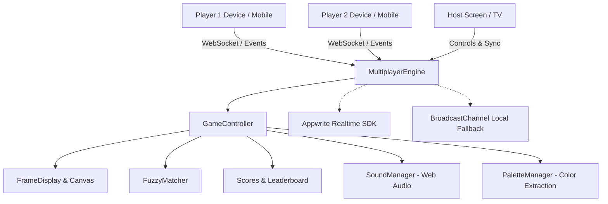

# 🎬 Guess The Frame — Master Project Documentation

> **Guess The Frame By Asmit** is a high-energy, interactive cinema frame guessing party game featuring real-time online multiplayer, pass-and-play local party mode, dynamic visual styling (Claymorphism), adaptive color palettes, synthesized audio, and smart fuzzy answer matching.

---

## 📌 Table of Contents

1. [Project Overview](#-project-overview)
2. [Key Features](#-key-features)
3. [Architecture & Tech Stack](#-architecture--tech-stack)
4. [Game Modes & Content Catalogs](#-game-modes--content-catalogs)
5. [Multiplayer & Scoring Mechanics](#-multiplayer--scoring-mechanics)
6. [Core System Modules](#-core-system-modules)
7. [Directory Structure](#-directory-structure)
8. [Setup & Running Locally](#-setup--running-locally)
9. [Deployment Guide](#-deployment-guide)
10. [Roadmap & Future Enhancements](#-roadmap--future-enhancements)

---

## 🌟 Project Overview

**Guess The Frame** combines the excitement of party trivia (like Jackbox and Kahoot) with cinema culture. Players race against the clock as a heavily blurred movie still, cropped celebrity eye close-up, or classic dialogue quote gradually reveals itself. 

Players can compete locally on a shared screen or join an **Online Multiplayer Room** from their phones or laptops using a 4-letter room code or QR code.

### Core Highlights
- ⚡ **Zero-Install Client**: Fully functional SPA built with pure HTML5, CSS3, and modern JavaScript.
- 🌐 **Real-Time Multiplayer**: Instant room creation, live state synchronization, and simultaneous multi-device guessing.
- 🎨 **Claymorphism Aesthetic**: Tactile 3D pastel clay design, rounded cards, organic shadows, and smooth micro-animations.
- 🎭 **Animated Avatars**: Custom animated sprite avatars (Aman, Amish, Aziz, Vish) with frame-by-frame animations.
- 🔊 **Zero-Latency Web Audio**: Procedurally generated sound effects (ticks, buzzers, fanfare, clicks) synthesized on the fly via the Web Audio API.
- 🎯 **Smart Fuzzy Matching**: Intelligent typo-tolerant answer validation that ignores articles, punctuation, and minor spelling mistakes.

---

## 🚀 Key Features

### 1. Game Flow & Screens
- **Home Screen**: Instant entry point with options to **Create Online Room**, **Join Online Room**, or launch **Pass & Play (Local)**.
- **Room Lobby**: Host customization panel (round counts, timer length, active modes), real-time player list with animated avatar cards, copyable invite link, and QR code modal.
- **Live Game Arena**: High-definition cinematic viewport with progressive unblur animation, simultaneous typing input, countdown timer, live leaderboard, and host floating control bar.
- **Answer Reveal Screen**: Instant unblur showing movie title, release year, director/trivia, and points awarded.
- **Sudden Death Tie Breaker**: Automatic 1v1 rapid-fire duel when two or more players tie for 1st place.
- **Winner Podium**: 3D podium for 1st, 2nd, and 3rd place with animated avatars, trophies, confetti particles, and rematch triggers.

### 2. Audio & Visual Immersion
- **Dynamic Palette Extraction (`PaletteManager`)**: Analyzes the dominant and accent colors of the active movie frame using HTML5 Canvas and adapts the UI background glow dynamically.
- **Synthesized SFX (`SoundManager`)**: Custom Web Audio oscillators create procedural sound effects without downloading bulky audio files.
- **Confetti Engine**: Native canvas confetti particle physics on victory and correct answer streaks.

---

## 🛠️ Architecture & Tech Stack



### Technology Breakdown
| Component | Technology | Description |
| :--- | :--- | :--- |
| **Core Frontend** | Vanilla HTML5 / ES6+ JavaScript | Standalone single-page application, zero build tool dependency |
| **Styling** | Vanilla CSS3 (Claymorphism) | Custom properties, soft inner/outer box shadows, responsive grid/flexbox |
| **Multiplayer Sync** | Appwrite Realtime / BroadcastChannel | Real-time bi-directional WebSocket messaging with local channel fallback |
| **QR Code Engine** | `qrcode.js` (CDN) | Real-time QR code generation for quick mobile room joining |
| **Audio Engine** | Web Audio API (`AudioContext`) | Synthesized audio oscillators, noise generators, and gain nodes |
| **Graphics & Palettes** | HTML5 2D Canvas API | Color quantization for adaptive UI themes and animated sprite playback |

---

## 🎮 Game Modes & Content Catalogs

The game features three distinct categories plus a specialized tie breaker mode:

### 1. 🎬 Guess The Frame (`GUESSTHEFRAME/`)
Players guess the movie from an iconic, beautiful cinematography still that unblurs over 30 seconds.
- *2001: A Space Odyssey (1968)*
- *A Wednesday (2008)*
- *Athiradi (2026)*
- *Boogie Nights (1997)*
- *Drishyam 3 (2026)*
- *Ferrari Ki Sawaari (2012)*
- *Gram Chikitsalaya Season 2 (2026)*
- *I Swear (2025)*
- *Licorice Pizza (2021)*
- *Made In India: A Titan Story (2026)*
- *Mulholland Drive (2001)*
- *No Smoking (2007)*
- *Peepli Live (2010)*
- *Rush (2023)*
- *Sapne Vs Everyone (2023)*
- *The Drama (2026)*
- *The Sheep Detectives (2026)*
- *Widow's Bay (2026)*
- *Wind River (2017)*
- *Zero (2018)*

### 2. 👁️ Guess The Eyes (`GUESSTHEEYES/`)
Players identify famous actors/celebrities from extreme eye closeups, which reveal to the full portrait upon answer confirmation.
- *Adria Arjona*
- *Anthony Mackie*
- *Antony Starr*
- *Emily Blunt*
- *Emma Stone*
- *Kate Hudson*
- *Olivia Cooke*
- *Rachel Brosnahan*
- *Shraddha Kapoor*
- *Zoe Saldaña*

### 3. 💬 Guess The Dialogue (`diaouge. txt`)
Classic comedic and dramatic punchlines from iconic films:
- *"Aaya hoon, kuch toh loot kar jaunga... Khandani chor hoon main, khandani!"* — *Andaaz Apna Apna*
- *"Khoon kharabe wale khandan se aata hoon... roz subah uthkar 2-4 khoon na karoon..."* — *Hungama*
- *"Yeh koi tareeka hai bheek maangne ka?!"* — *Golmaal*
- *"Meri ek taang nakli hai, main hockey ka bohot bada khiladi tha..."* — *Welcome*
- *"Arey ₹5 mein chicken biryani de raha hai re woh!"* — *Run*
- *"We're looking for two oil boys who can grease us up before each competition."* — *Dumb and Dumber*
- *"It’s not a purse, it’s a satchel. Gods and Indiana Jones wears one."* — *The Hangover*
- *"I'm not Bad. I'm just Drawn That Way."* — *Who Framed Roger Rabbit*
- *"I don't want to survive. I want to live."* — *Wall-E*
- *"I wasted so much time worrying what could go wrong..."* — *The Worst Person in the World*

### 4. ⚔️ Sudden Death / Tie Breaker (`tie breaker/`)
Rapid-fire duel frames deployed when two or more players tie for 1st place:
- *Anatomy of a Fall (2023)*, *Eyes Wide Shut (1999)*, *Ghilli (2004)*, *La Haine (1995)*, *Mad Max 2 (1981)*, *Moonrise Kingdom (2012)*, *The Batman (2022)*, *The Holdovers (2023)*, *The Life of Chuck (2024)*, *The Lighthouse (2019)*, *The Wolf of Wall Street (2013)*, *They Call Him OG (2025)*, *Top Gun Maverick (2022)*, *Under the Silver Lake (2018)*.

---

## ⚡ Multiplayer & Scoring Mechanics

### 1. Room Creation & Joining
- **Room Code**: 4-letter uppercase code (e.g. `FILM`, `CINE`, `STAR`).
- **Shareable Link**: One-click URL copy (`https://domain.com/?room=FILM`).
- **QR Code**: Instant mobile scanning using device camera.

### 2. Simultaneous Guessing & Instant Position Scoring
Players all guess at the same time on their personal devices while the frame unblurs:
| Finish Order | Points Awarded | Behavior |
| :---: | :---: | :--- |
| **🥇 1st Correct** | **+10 pts** | Awarded instantly; triggers chime SFX & screen badge |
| **🥈 2nd Correct** | **+7 pts** | Awarded instantly to second fastest correct guesser |
| **🥉 3rd Correct** | **+5 pts** | Awarded instantly to third fastest correct guesser |
| **4th+ / Timeout** | **0 pts** | No points awarded |

> **Round End Trigger**: As soon as **3 players** have guessed correctly, or when the **30-second round timer** reaches 0, the round completes and transitions to the unblurred reveal.

### 3. Smart Fuzzy Matching (`FuzzyMatcher`)
- **Case & Space Insensitive**: Converts all answers to normalized uppercase/lowercase.
- **Article Stripping**: Ignores common prefixes like `"The "`, `"A "`, `"An "`.
- **Punctuation Clean-up**: Strips apostrophes, hyphens, colons, and commas (e.g., `"Wall-E"` = `"Wall E"` = `"Walle"`).
- **Levenshtein Distance**: Tolerates typos with an edit distance $\le 2$ (e.g., `"Oppenhimer"` $\rightarrow$ `"Oppenheimer"`).

### 4. Host Live Moderation
The host has a floating control bar during active gameplay:
- `⏭ Skip Frame`: Advance to the next frame immediately.
- `⏸ Pause / Resume`: Freeze/unfreeze the countdown timer.
- `🏁 End Game`: Terminate match early and jump to the podium.

---

## 🧩 Core System Modules

| Module | Responsibility |
| :--- | :--- |
| `MultiplayerEngine` | Manages Appwrite WebSocket channels, broadcast relays, room state, heartbeat, and remote RPCs. |
| `RoomLobby` | Handles host match settings, player joined/left events, avatar selection, ready state, and lobby chat. |
| `GameController` | Core game loop: tracks current round, frame playlists, time ticks, unblur stages, and scoring events. |
| `Scores` | Maintains score state, player streaks, leaderboards, position rankings, and tie detection. |
| `FuzzyMatcher` | Normalizes input text, calculates Levenshtein distance, and verifies answer correctness against aliases. |
| `SoundManager` | Web Audio API synthesizer for sound effects: tick, buzzer, chime, cheer, click, and volume/mute controls. |
| `PaletteManager` | Canvas-based image color analyzer that extracts dominant tones and updates CSS variables dynamically. |
| `FrameDisplay` | Handles high-performance image preloading, canvas/CSS blur filtering, and asset caching. |
| `UI` | Screen routing (`homeScreen`, `playerLobbyScreen`, `gameScreen`, `winnerScreen`), modals, and DOM updates. |

---

## 📁 Directory Structure

```plaintext
appwrite-skills/
├── .agents/                    # Agent & skill configuration files
│   └── skills/                 # Language and capability skills
├── avvtar/                     # Animated sprite avatar frames
│   ├── aman/                   # Frame-by-frame PNG sequences
│   ├── amish/                  # Frame-by-frame PNG sequences
│   ├── aziz/                   # Frame-by-frame PNG sequences
│   └── vish/                   # Frame-by-frame PNG sequences
├── bg/                         # Background and branding artwork
│   ├── cinema_bg.jpeg          # Cinema hall atmosphere backdrop
│   └── guess_the_frame.png     # Logo & banner assets
├── GUESSTHEEYES/               # Celebrity closeups & full portrait assets
├── GUESSTHEFRAME/              # Movie stills catalog
├── tie breaker/                # Sudden death tie breaker frame catalog
├── diaouge. txt                # Movie quotes and dialogue catalog
├── index.html                  # Unified application bundle (HTML + CSS + JS)
├── logo.png                    # Game logo asset
├── project.md                  # Master documentation (this file)
└── walkthrough.md              # Feature implementation log
```

---

## 💻 Setup & Running Locally

Because **Guess The Frame** is built with standard web technologies, no build step or package installation is required.

### 1. Quick Local Server
Run with any lightweight static HTTP server:

```bash
# Python 3
python -m http.server 8000

# Node.js npx
npx serve .

# VS Code
# Open folder in VS Code and click "Go Live" with Live Server extension
```

### 2. Multi-Device & Mobile Testing
1. Ensure your phone and computer are on the same Wi-Fi network.
2. Find your computer's local IP address (`ipconfig` on Windows or `ifconfig` on macOS/Linux).
3. Open `http://<YOUR_LOCAL_IP>:8000` on your mobile browser or scan the in-game QR code.
4. For cross-tab testing on a single computer, simply open multiple browser tabs or an incognito window.

---

## 🌐 Deployment Guide

### Deploying to Vercel (Recommended)
```bash
# Install Vercel CLI (if not already installed)
npm install -g vercel

# Deploy directly from workspace root
vercel --prod
```

### Deploying to GitHub Pages
1. Push this repository to GitHub.
2. In your repository settings, navigate to **Pages**.
3. Under **Branch**, select `main` (or `master`) and folder `/ (root)`.
4. Click **Save**. The game will be live at `https://<username>.github.io/<repo-name>/`.

---

## 🔮 Roadmap & Future Enhancements

- [ ] **Custom Community Packs**: Allow users to drag-and-drop custom frame folders to create their own trivia packs.
- [ ] **Anti-Cheat Cloud Function**: Run secret answer validation inside Appwrite Cloud Functions for competitive tournaments.
- [ ] **Voice Chat / Audio Buzzers**: WebRTC audio channels for live party banter.
- [ ] **Spectator Mode**: Support 50+ spectators in large stream/party broadcasts.

---

<div align="center">
  <sub>Crafted with passion for cinema & gaming by <b>Asmit</b>.</sub>
</div>
